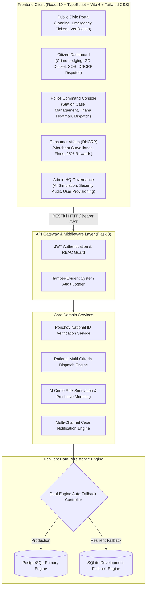

# SentinelX - System Architecture & Entity-Relationship Documentation

National Civil Safety & Consumer Grievance Platform — People's Republic of Bangladesh.

---

## 1. High-Level System Architecture

---

## 2. Entity-Relationship Diagram (ERD)

```mermaid
erDiagram
    User ||--o{ CrimeReport : "lodges (as Reporter)"
    User ||--o{ CrimeReport : "assigned_to_investigate (as Officer)"
    User ||--o{ SOSRequest : "triggers"
    User ||--o{ ConsumerComplaint : "lodges (as Complainant)"
    User ||--o{ AuditLog : "initiates"
    User ||--o{ NotificationItem : "receives"
    User ||--o{ CaseMessage : "sends"

    ShopReputation ||--o{ ConsumerComplaint : "subject_of"
    BarcodeVerification ||--o{ ConsumerComplaint : "cross_referenced_by"

    User {
        string id PK "Unique Identifier"
        string nidNumber UK "National ID Number"
        string fullName "Legal Full Name"
        string email UK "Official/Personal Email"
        string phone "Contact Number"
        string role "CITIZEN | POLICE | CONSUMER_RIGHTS | ADMIN"
        string badgeNumber "BP/DMP Badge ID"
        string designation "Rank / Official Title"
        string department "Crime Cell / Division"
        string stationOrThana "Assigned Jurisdiction / Thana"
        boolean isNIDVerified "Identity Verification Status"
        string passwordHash "Bcrypt Hashed Password"
        string createdAt "ISO 8601 Timestamp"
    }

    CrimeReport {
        string id PK "Unique Identifier"
        string caseId UK "CR-DIST-YEAR-XXXX Code"
        string reporterId FK "Reference to User (Reporter)"
        string reporterName "Reporter Legal Name"
        string reporterNID "Reporter National ID"
        boolean requestConfidentiality "Whistleblower Protection"
        string crimeType "Crime Classification Category"
        string title "Incident Title"
        text description "Detailed Deposition Narrative"
        string locationName "Landmark / Neighborhood"
        string district "Administrative District"
        string thana "Jurisdiction Police Station"
        float latitude "GPS Latitude"
        float longitude "GPS Longitude"
        string severity "CRITICAL | HIGH | MEDIUM | LOW"
        string status "SUBMITTED | OFFICER_ASSIGNED | VERIFIED | INVESTIGATION | CASE_CLOSED | REJECTED"
        text evidenceJson "JSON Array of Evidence Files & Digital Hashes"
        string assignedOfficerId FK "Reference to User (Investigator)"
        string assignedOfficerName "Formal Rank & Name of Officer"
        string assignedOfficerBadge "Regional Badge Number"
        string assignedOfficerStation "Station Jurisdiction"
        text investigationUpdatesJson "Chronological Case Audit Trail"
    }

    ConsumerComplaint {
        string id PK "Unique Identifier"
        string trackingNumber UK "DNCRP-YEAR-XXXX Tracking Code"
        string complainantId FK "Reference to User (Citizen)"
        string complainantName "Complainant Full Name"
        string shopName "Merchant / Business Name"
        string shopAddress "Physical Location"
        string shopDistrict "Commercial District"
        string shopThana "Commercial Thana"
        string tradeLicenseOrBIN "Business Identification / BIN"
        string productName "Goods / Commodity Name"
        string barcode "BSTI Barcode Number"
        string issueType "PRICE_GOUGING | EXPIRED_GOODS | ADULTERATION | FAKE_SEAL"
        float pricePaid "Price Demanded / Paid"
        float mrp "Official Pack MRP"
        text description "Detailed Complaint Deposition"
        string status "SUBMITTED | UNDER_INVESTIGATION | HEARING_SCHEDULED | PENALTY_IMPOSED | RESOLVED"
        text penaltyImposed "Imposed Fine & 25% Citizen Bounty"
        text evidenceJson "Attached Receipts & Packaging Photos"
    }

    ShopReputation {
        string id PK "Shop Unique ID"
        string shopName "Retail / Wholesale Establishment"
        string tradeLicenseOrBIN UK "Trade License / BIN Number"
        string district "Operating District"
        string thana "Operating Thana"
        float trustScore "Dynamic Consumer Rating (1.0 - 5.0)"
        int totalComplaints "Historical Complaints Count"
        int resolvedComplaints "Successfully Resolved Complaints"
        int verifiedFinesCount "Penalties Imposed by Mobile Courts"
        string complianceStatus "GOOD | UNDER_WATCHLIST | SANCTIONED"
    }

    SOSRequest {
        string id PK "Unique Beacon ID"
        string citizenId FK "Reference to User"
        string citizenName "Citizen Full Name"
        string citizenPhone "Emergency Callback Number"
        string locationName "Incident Coordinates Landmark"
        float latitude "Live GPS Latitude"
        float longitude "Live GPS Longitude"
        string status "SOS_SENT | DISPATCHED | PATROL_ARRIVED | RESOLVED"
        string assignedUnit "Dispatched Patrol Unit / Team"
        string createdAt "Distress Trigger Timestamp"
        string respondedAt "Police Acknowledgment Timestamp"
    }

    EmergencyAlert {
        string id PK "Alert Unique ID"
        string alertCode UK "EA-DIST-XXXX Broadcast Identifier"
        string emergencyType "WEATHER_HAZARD | CIVIL_DEFENSE | SECURITY_LOCKDOWN | MISSING_PERSON"
        string title "Broadcast Headline"
        text message "Official Public Advisory"
        string affectedArea "Targeted Municipal / Thana Zones"
        string district "Affected District"
        float radiusKm "Dissemination Perimeter Radius"
        string severity "CRITICAL | HIGH | ADVISORY"
        string expirationTime "Automatic Deprecation Timestamp"
        boolean isActive "Live Broadcast State"
    }

    BarcodeVerification {
        string barcode PK "GS1 / BSTI Barcode (13 digits)"
        string productName "Registered Consumer Product"
        string companyName "Certified Manufacturer / Importer"
        string bstiStandard "BDS Certification Number"
        float mrp "Legally Mandated Ceiling Price"
        boolean isRegistered "National Database Registration Status"
        string status "AUTHENTIC | COUNTERFEIT | RECALLED"
    }

    CaseMessage {
        string id PK "Message Unique ID"
        string caseId FK "Reference to Crime or Consumer Case"
        string caseType "CRIME | CONSUMER"
        string senderId FK "Reference to User"
        string senderName "Sender Full Name"
        string senderRole "Role (CITIZEN, POLICE, CONSUMER_RIGHTS)"
        text message "Secure Chat / Deposition Content"
        boolean isOfficialNotice "Legal Evidentiary Status"
        string timestamp "Dispatch Timestamp"
    }

    AuditLog {
        string id PK "Audit Log Hash ID"
        string timestamp "Immutable Action Timestamp"
        string userId "Actor Identifier"
        string userName "Actor Full Name"
        string userRole "Actor Security Clearance"
        string action "LODGE_REPORT | VERIFY_REPORT | STATUS_CHANGE"
        string resource "Target Entity (Case ID, User ID)"
        string ipAddress "Client Network Address"
        string status "SUCCESS | DENIED | FAILED"
        text details "Structured Security Context"
    }

    NotificationItem {
        string id PK "Notification ID"
        string userId FK "Recipient User Reference"
        string type "CASE_UPDATE | EMERGENCY_BROADCAST | SOS_ACK"
        string title "Notification Headline"
        text message "Full Body Narrative"
        string relatedId "Related Entity Reference ID"
        boolean isRead "Read State"
        string createdAt "Dispatch Timestamp"
    }
```

---

## 3. Police Jurisdiction & Security Architecture

### Strict Station-Level Multi-Tenancy
1. **Jurisdiction Boundary Isolation**: Police officers stationed at a specific Thana (e.g. *Paltan Police Station, Dhaka*) have access restricted **strictly** to cases registered within their thana keyword or assigned explicitly to their badge ID.
2. **Action Authorization Guard**: Any unauthorized request by an officer to inspect, verify, or status-update a case outside their territorial jurisdiction is immediately terminated with an HTTP `403 Forbidden` response and logged to the central `audit_logs` registry.
3. **Rational Multi-Criteria Dispatch Engine**:
   - **Rank vs. Severity Alignment**: High/Critical severity cases require Senior Command authority (*Inspector / OC*), Medium severity routes to *Sub-Inspector (SI)*, and Routine/Low severity routes to *Assistant Sub-Inspector (ASI)*.
   - **Specialization Matching**: Cyber and digital fraud incidents are routed with an affinity bonus (+40 pts) to officers posted in the *Cyber Crime & Digital Forensics Cell*.
   - **Workload Balance**: Subtracts 10 points per open active case to prevent officer fatigue and bottlenecks.
